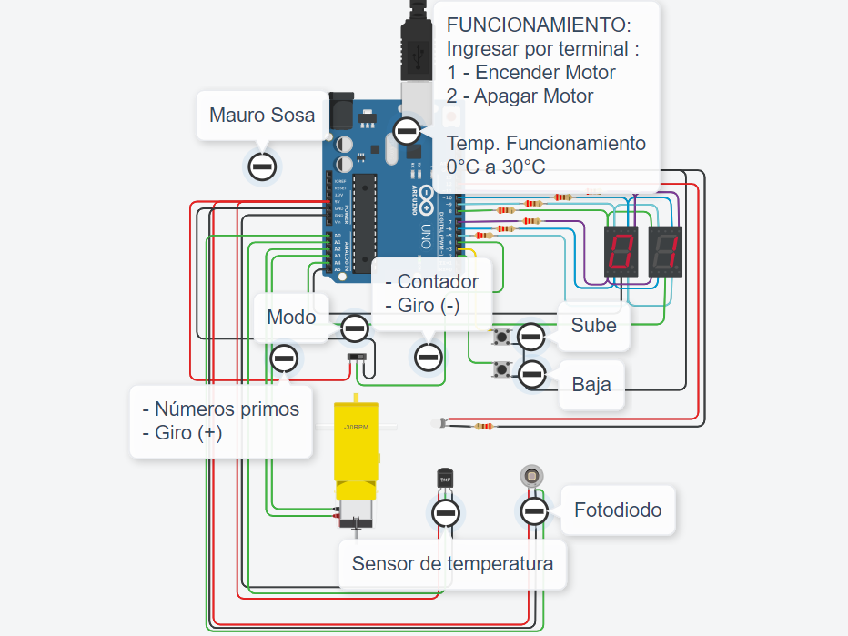

# Documentación


## Integrantes

- Mauro Sosa

## Proyecto: Parcial 1.



## Descripción

El proyecto costa de dos display 7 segmentos, los cuales a través de un interruptor deslizante (switch) y dos botones (conexión pullup) logran indicar:

- Números primos
- Contador 0 a 99
  Además, la función general del proyecto es controlar un motor de aficionado, el cual será puesto en marcha una vez que el usuario ingrese la opción indicada por terminal. Estará vinculado con un sensor de temperatura, que apagará el motor una vez este llegue a una temperatura superior a 100 °C. El giro del motor dependerá del estado del interruptor deslizante (switch).

## Función principal

- imprimirDisplay
- prendeDisplay
- imprimirDigito
- esPrimo
- numeroPrimoDisplay

```C (lenguaje en el que esta escrito)
void EncenderBinario(int estado3, int estado2,int estado1,int estado0)
{
  digitalWrite(B3,estado3);
  digitalWrite(B2,estado2);
  digitalWrite(B1,estado1);
  digitalWrite(B0,estado0);
}
```

## :robot: Link al proyecto

- [proyecto](https://www.tinkercad.com/things/2qQMSe9IU7U-mauro-sosa-1d-parcial-parte-2-/editel?sharecode=W0wKO39AYSWAxuNdpO5i2tp-pWip2XSOkXhDSDocGd0)

---

### Fuentes

- [Consejos para documentar](https://www.sohamkamani.com/how-to-write-good-documentation/#architecture-documentation).

- [Lenguaje Markdown](https://markdown.es/sintaxis-markdown/#linkauto).

- [Markdown Cheatsheet](https://github.com/adam-p/markdown-here/wiki/Markdown-Cheatsheet).

- [Tutorial](https://www.youtube.com/watch?v=oxaH9CFpeEE).

- [Emojis](https://gist.github.com/rxaviers/7360908).

---
